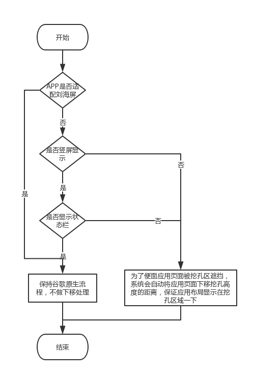

# Android适配刘海屏，

#### 背景

自从iphoneX发布之后，带有刘海的手机的发布应接不暇，各大厂商纷纷效仿，
目前华为，小米，OV等厂商都已经发布了自己的带有刘海的手机。并且Google
大大在今年的IO大会上也已经推出基于Android P 适配方案，但是各大厂商在
P之前就已经发布，我们开发者要针对这些机型最做适配，需要查阅相关厂商的
开发文档，做好我们APP的适配工作。

#### 个人理解

针对手机的刘海区域，是不可操作区域，如果我们的APP（非游戏类APP和可切换
横屏APP）实现了沉浸式状态栏效果，那么一般情况下，刘海区域会在状态栏里，
基于我们的UI设计，一般会把重要的View放在安全区域内，固当是这种情况的时
候，不需要考虑相关适配。如果没有实现沉浸式状态栏，并且是全屏应用，那么
我们就要考虑我们view是否在安全区，这样就要判断手机是否是刘海屏，并且需
要判断相应的刘海区域，然后根据区域的不同，调整我们在刘海区的控件位置。
游戏类APP和可横屏APP的适配同上。

#### 安全区示意图


### 各个厂商适配方案

#### google Android P 适配方案
[Google官网传送门](https://developer.android.com/preview/features#cutout)

Google 从Android P开始提供刘海屏适配方案，通过全新的DisplayCutout类，
可以确定非功能区的位置和形状，这个区域即为刘海区，刘海区不应该显示内容，
通过getDisplayCutout()确定当前手机是否包含刘海区。

我们可以通过修改WindowManager.LayoutParams.layoutInDisplayCutoutMode的
状态来对APP的内容进行布局，Google提供了3种状态可选

1. LAYOUT_IN_DISPLAY_CUTOUT_MODE_DEFAULT
2. LAYOUT_IN_DISPLAY_CUTOUT_MODE_NEVER
3. LAYOUT_IN_DISPLAY_CUTOUT_MODE_SHORT_EDGES

三种状态分别表示DEFAULT只有当刘海区完全包含在状态栏时才是用，NEVER从不使
用刘海区域（这样会显示一条黑边距），SHORT_EDGES表示允许延伸到刘海区。

设置使用刘海区代码:
````
    getSupportActionBar().hide();
    getWindow().getDecorView().setSystemUiVisibility(View.SYSTEM_UI_FLAG_FULLSCREEN
     | View.SYSTEM_UI_FLAG_LAYOUT_FULLSCREEN); 
    //设置页面全屏显示
    WindowManager.LayoutParams lp = getWindow().getAttributes();
    lp.layoutInDisplayCutoutMode = WindowManager
    .LayoutParams.LAYOUT_IN_DISPLAY_CUTOUT_MODE_SHORT_EDGES; 
    //设置页面延伸到刘海区显示
    getWindow().setAttributes(lp);
````

PS:如果应用的布局需要延伸到刘海区显示，那么需要设置View.SYSTEM_UI_FLAG_LAYOUT_FULLSCREEN
同时，如果需要修改状态栏的显示颜色，则需要这是View.SYSTEM_UI_FLAG_LIGHT_STATUS_BAR

获取刘海安全显示区大小和刘海尺寸信息代码：
````
    contentView = getWindow().getDecorView().findViewById(android.R.id.content).getRootView();
    contentView.setOnApplyWindowInsetsListener(new View.OnApplyWindowInsetsListener() {
        @Override
        public WindowInsets onApplyWindowInsets(View view, WindowInsets windowInsets) {
            DisplayCutout cutout = windowInsets.getDisplayCutout();
            if (cutout == null) {
                //通过cutout是否为null判断是否刘海屏手机
                Log.e(TAG, "cutout==null, is not notch screen");
            } else {
                List<Rect> rects = cutout.getBoundingRects();
                if (rects == null || rects.size() == 0) {
                    Log.e(TAG, "rects==null || rects.size()==0, is not notch screen");
                } else {
                    Log.e(TAG, "rect size:" + rects.size());//注意：刘海的数量可以是多个
                    for (Rect rect : rects) {
                        Log.e(TAG, "cutout.getSafeInsetTop():" + cutout.getSafeInsetTop()
                                + ", cutout.getSafeInsetBottom():" + cutout.getSafeInsetBottom()
                                + ", cutout.getSafeInsetLeft():" + cutout.getSafeInsetLeft()
                                + ", cutout.getSafeInsetRight():" + cutout.getSafeInsetRight()
                                + ", cutout.rects:" + rect
                        );
                    }
                }
            }
            return windowInsets;
        }
    });
````

PS：
1. 通过使用windowInsets.getDisplayCutout()是否为null判断是否刘海屏手机，如果为null为非刘海屏；
2. 如果是刘海屏手机，可以通过接口获取相关的刘海信息；
3. 刘海的个数可以有多个。

#### 华为适配方案

[华为官网传送门](https://devcenter-test.huawei.com/consumer/cn/devservice/doc/50114)

华为提供了一套Android O上的刘海适配过程图，从而方便了Android开发人员的
适配工作量，开发人员不必过多的去处理适配工作，华为EMUI会自动适配处理。



从上述华为处理逻辑图可以看出，华为会先判断手机是否为刘海屏手机，然后会继续判断横竖屏显示，
其次判断是否显示状态栏，如果符合条件，那么华为会对app的页面布局进行下移处理。

华为提供了相应的代码方法来判断当前手机是否有刘海屏和刘海屏大小的方法。

代码如下：
````
    /**
     * 华为手机是否有刘海屏
     *
     * @param context context
     * @return 是否有刘海屏
     */
    public static boolean hasNotchInScreen(Context context) {
        boolean ret = false;
        try {
            ClassLoader cl = context.getClassLoader();
            Class HwNotchSizeUtil = cl.loadClass("com.huawei.android.util.HwNotchSizeUtil")
            Method get = HwNotchSizeUtil.getMethod("hasNotchInScreen");
            ret = (boolean) get.invoke(HwNotchSizeUtil);
        } catch (ClassNotFoundException e) {
            Log.e("test", "hasNotchInScreen ClassNotFoundException");
        } catch (NoSuchMethodException e) {
            Log.e("test", "hasNotchInScreen NoSuchMethodException");
        } catch (Exception e) {
            Log.e("test", "hasNotchInScreen Exception");
        } finally {
            return ret;
        }

    /**
     * 获取华为刘海屏的刘海尺寸
     *
     * @param context context
     * @return 刘海尺寸
     */
    public static int[] getNotchSize4Huawei(Context context) {
        int[] ret = new int[]{0, 0};
        try {
            ClassLoader cl = context.getClassLoader();
            Class HwNotchSizeUtil = cl.loadClass("com.huawei.android.util.HwNotchSizeUtil");
            Method get = HwNotchSizeUtil.getMethod("getNotchSize");
            ret = (int[]) get.invoke(HwNotchSizeUtil);
        } catch (ClassNotFoundException e) {
            Log.e(TAG, "getNotchSize ClassNotFoundException");
        } catch (NoSuchMethodException e) {
            Log.e(TAG, "getNotchSize NoSuchMethodException");
        } catch (Exception e) {
            Log.e(TAG, "getNotchSize Exception");
        }
        return ret;
    }
}
````

根据相应代码，我们可以依此判断是否刘海屏和刘海区域大小，进行相关UI调整和适配。

并且，华为提供了2种适配方案：

方案一：

使用新增的Meta-data属性android.notch_support，在应用的AndroidManifest.xml中增加meta-data属性，
此属性不仅可以针对Application生效，也可以对Activity配置生效。

``<meta-data android:name="android.notch_support" android:value="true"/>``

PS：
1. 如果针对Application生效，意味着该应用的所有页面，系统都不会做竖屏场景的特殊下移或者横屏场景
特殊右移
2. 如果针对Activity生效，意味着可以针对单个页面进行刘海屏适配，设置该属性，仅针对当前的Ativity
不做相关处理

方案二：

使用给window添加新增的FLAG_NOTCH_SUPPORT，应用通过增加华为自定义的刘海屏flag，
来请求使用或者去除使用刘海区显示，

代码如下：
````
    /*刘海屏全屏显示FLAG*/
    private static final int FLAG_NOTCH_SUPPORT = 0x00010000;

    /**
     * 设置应用窗口在华为刘海屏手机使用刘海区
     *
     * @param window 应用页面window对象
     */
    public static void setFullScreenWindowLayoutInDisplayCutout(Window window) {
        if (window == null) {
            return;
        }
        WindowManager.LayoutParams layoutParams = window.getAttributes();
        try {
            Class layoutParamsExCls = Class.forName("com.huawei.android.view.LayoutParamsEx");
            Constructor con = layoutParamsExCls.getConstructor(WindowManager.LayoutParams.class);
            Object layoutParamsExObj = con.newInstance(layoutParams);
            Method method = layoutParamsExCls.getMethod("addHwFlags", int.class);
            method.invoke(layoutParamsExObj, FLAG_NOTCH_SUPPORT);
        } catch (Exception e) {
            Log.e(TAG, "other Exception");
        }
    }

    /**
     * 设置应用窗口在华为刘海屏手机使用刘海区
     *
     * @param window 应用页面window对象
     */
    public static void setNotFullScreenWindowLayoutInDisplayCutout(Window window) {
        if (window == null) {
            return;
        }
        WindowManager.LayoutParams layoutParams = window.getAttributes();
        try {
            Class layoutParamsExCls = Class.forName("com.huawei.android.view.LayoutParamsEx");
            Constructor con = layoutParamsExCls.getConstructor(WindowManager.LayoutParams.class);
            Object layoutParamsExObj = con.newInstance(layoutParams);
            Method method = layoutParamsExCls.getMethod("clearHwFlags", int.class);
            method.invoke(layoutParamsExObj, FLAG_NOTCH_SUPPORT);
        } catch (Exception e) {
            Log.e(TAG, "other Exception");
        }
    }
````

PS:对Application生效，意味着该应用的所有页面，系统都不会做竖屏场景的特殊下移或者是
横屏场景的右移特殊处理
PS:在代码里使用，需要在调用后添加
getWindowManager()
.updateViewLayout(getWindow().getDecorView(),getWindow().getDecorView().getLayoutParams());
否则，不会刷新页面生效。

#### 小米适配方案

[小米适配传送门](https://dev.mi.com/console/doc/detail?pId=1293)

小米针对刘海屏手机提供了2种适配规则，分为系统适配和开发者适配。

##### 系统级适配规则：

由于使用刘海屏，可能会碰到如下问题，

- 顶部内容会被 Notch 遮挡
- 如何处理耳朵区的显示区域
- 为了保证绝大部分应用都能正常显示，同时尽可能利用屏幕的显示区域。

MIUI System UI 制定了以下全局规则：

- status bar 略高于 Notch 高度，对于应用来说，相当于一个更高的 status bar。
- 当应用显示 status bar 时（如微信首页），允许应用使用耳朵区
（背后的逻辑是：因为 status bar 区域本身不可交互，且会显示信号、电池等信息，
因此我们假定应用不会在该区域放置重要的内容和可交互的控件）。
- 当应用不显示 status bar 时（如全屏游戏），不允许应用使用耳朵区，系统默认填黑。
- 横屏时，默认均不允许使用耳朵区，系统默认填黑。
- 不允许应用180度倒转显示

##### 开发者适配：

系统规则只能解决最基础的可用性问题，在系统规则下，开发者仍需要检查以下内容：

- 检查系统默认规则是否有可用性问题，考虑是否做针对性优化。
- 检查 status bar 的显示策略。重新考虑是否隐藏 status bar
- 尽量避免某些页面显示 status bar，某些页面又隐藏，
否则会出现页面跳变的情况（应用的可用高度变了）。
- 检查横屏的情况，确定是否需要利用横屏的Notch，
若使用，需兼顾 Notch 出现在左边/右边的情况。
- 检查是否写死了状态栏的高度值。Notch机器状态栏的值是变化的，
建议改为读取系统的值（后有相关方法说明）。
- 检查开启「隐藏屏幕刘海」后，应用是否显示异常（详见后文）。
- 检查普通屏幕的显示，保证应用在普通屏幕和 Notch 屏幕下都能正常显示 。

整体而言，就是在系统默认处理的情况下，开发者仍需要进行相关的排查和相关适配

小米获取是否有刘海屏的代码如下:

````
    /**
     * 判断小米是否有刘海屏
     *
     * @return 是否有刘海屏
     */
    public static boolean hasNotchInScreenAtXiaomi() {
        return SystemProperties.getInt("ro.miui.notch", 0) == 1;
    }
````

PS:由于SystemProperties类为隐藏类，需要在app下build.gradle文件android{}中添加相关代码，才可正常使用。

SystemProperties 配置代码如下：
````
    //以下是为了找到android.os.SystemProperties这个隐藏的类
    String SDK_DIR = System.getenv("ANDROID_SDK_HOME")
    //("TAG", "SDK_DIR = " + SDK_DIR );
    if(SDK_DIR == null) {
        Properties props = new Properties()
        props.load(new FileInputStream(project.rootProject.file("local.properties")))
        SDK_DIR = props.get('sdk.dir')
    }
    dependencies {
        compileOnly files("${SDK_DIR}/platforms/android-21/data/layoutlib.jar")
    }
````

获取相关刘海区域的宽高代码如下：

````
     /**
     * 获得小米刘海屏幕高度
     *
     * @param context context
     * @return 小米屏幕高度
     */
    public static int getNotchXiaomiHeight(Context context) {
        int result = 0;
        int resourceId = context.getResources().getIdentifier("notch_height", "dimen", "android");
        if (resourceId > 0) {
            result = context.getResources().getDimensionPixelSize(resourceId);
        }
        return result;
    }

    /**
     * 获得小米刘海屏幕宽度
     *
     * @param context context
     * @return 小米屏幕宽度
     */
    public static int getNotchXiaomiWidth(Context context) {
        int result = 0;
        int resourceId = context.getResources().getIdentifier("notch_width", "dimen", "android");
        if (resourceId > 0) {
            result = context.getResources().getDimensionPixelSize(resourceId);
        }
        return result;
    }
````

如果针对Application级别处理，app的全部页面都遵循统一处理，需要在AndroidManifest.xml下application
添加：
````
    <meta-data
     android:name="notch.config"
     android:value="portrait|landscape"/>
````

其中value有以下4个值可取：

````
"none" 横竖屏都不绘制耳朵区
"portrait" 竖屏绘制到耳朵区
"landscape" 横屏绘制到耳朵区
"portrait|landscape" 横竖屏都绘制到耳朵区
````

一旦开发者使用了meta-data,系统会优先遵循开发者声明。

如果针对Window级别处理，需要开发者在WindowManager.LayoutParams 
增加 extraFlags 成员变量，用以声明该 window 是否使用耳朵区。

extraFlags有以下变量

````
    0x00000100 开启配置
    0x00000200 竖屏配置
    0x00000400 横屏配置
````

通过对Window添加addExtraFlags 和 clearExtraFlags 来修改使用耳朵区。

使用代码如下：

````
    /**
     * 小米删除刘海区域
     *
     * @param context context
     */
    public static void clearExtraFlag(Context context) {
        int flag = 0x00000100 | 0x00000200 | 0x00000400;
        if (context instanceof AppCompatActivity) {
            AppCompatActivity app = (AppCompatActivity) context;
            try {
                Method method = Window.class.getMethod("clearExtraFlags",
                        int.class);
                method.invoke(app.getWindow(), flag);
            } catch (Exception e) {
                Log.i(TAG, "addExtraFlags not found.");
            }
        }
    }

    /**
     * 小米添加刘海区域
     *
     * @param context context
     */
    public static void addExtraFlag(Context context) {
        int flag = 0x00000100 | 0x00000200 | 0x00000400;
        if (context instanceof AppCompatActivity) {
            AppCompatActivity app = (AppCompatActivity) context;
            try {
                Method method = Window.class.getMethod("addExtraFlags",
                        int.class);
                method.invoke(app.getWindow(), flag);
            } catch (Exception e) {
                Log.i(TAG, "addExtraFlags not found.");
            }
        }
    }
````

最后，小米还提供一套"隐藏刘海屏"适配，MIUI 针对 Notch 设备，
有一个“隐藏屏幕刘海”的设置项（设置-全面屏-隐藏屏幕刘海），
具体表现是：系统会强制盖黑状态栏（无视应用的Notch使用声明），
视觉上达到隐藏刘海的效果。但会给某些应用带来适配问题（控件/内容遮挡或过于靠边等）。

针对这种情况，需要先判断用户是刘海屏的基础上，用户是否隐藏了相关的刘海屏做判断，
判断代码如下：
````
    /**
     * 判断用户是否开启了隐藏刘海区域
     *
     * @param context
     * @return
     */
    public static boolean isHideNotchScreen4Xiaomi(Context context) {
        return Settings.Global.getInt(context.getContentResolver(), "force_black", 0) == 1;
    }
````
判断建议：如果用户是刘海屏，并且隐藏了刘海区域，那么建议恢复默认。

#### OPPO&VIVO适配方案

[OPPO官方传送门](https://open.oppomobile.com/service/message/detail?id=61876)

[VIVO官方传送门](https://dev.vivo.com.cn/documentCenter/doc/103)

OPPO&VIVO官方只给出了相关适配建议（文档内容真是少的可怜），并没有给出相关的具体方案，
如果手机是刘海屏，并且为竖屏显示状态栏，建议不要在危险区域显示重要信息或者相应View的点击事件。

````
    private static final int NOTCH_IN_SCREEN_VOIO = 0x00000020;//是否有凹槽
    private static final int ROUNDED_IN_SCREEN_VOIO = 0x00000008;//是否有圆角

    /**
     * 判断是否有刘海屏
     *
     * @param context context
     * @return 是否有刘海屏
     */
    public static boolean hasNotchInScreenAtVoio(Context context) {
        boolean ret = false;
        try {
            ClassLoader cl = context.getClassLoader();
            Class FtFeature = cl.loadClass("android.util.FtFeature");
            Method get = FtFeature.getMethod("isFeatureSupport", int.class);
            ret = (boolean) get.invoke(FtFeature, NOTCH_IN_SCREEN_VOIO);

        } catch (ClassNotFoundException e) {
            Log.e(TAG, "hasNotchInScreen ClassNotFoundException");
        } catch (NoSuchMethodException e) {
            Log.e(TAG, "hasNotchInScreen NoSuchMethodException");
        } catch (Exception e) {
            Log.e(TAG, "hasNotchInScreen Exception");
        } finally {
            return ret;
        }
    }

    /**
     * 判断oppo是否有刘海屏
     *
     * @param context context
     * @return 是否有刘海屏
     */
    public static boolean hasNotchInScreenAtOppo(Context context) {
        return context.getPackageManager().hasSystemFeature("com.oppo.feature.screen.heteromorphism");
    }
````

#### UI建议

布局原则：保证重要的文字、图片、视频信息、可点击的控件和图标，应用弹窗等，
建议显示在状态栏区域以下（安全区域）。如果内容不重要或者不会遮挡，
布局可以延伸到状态栏区域（危险区域）。
强烈建议UI小姐姐们，在设计UI的时候考虑到刘海屏手机，针对刘海屏手机做出合理
的UI设计，防止程序员小哥哥们在适配刘海屏手机时一脸雾水。

### 总结

通过各厂商提供的适配指南，个人感觉，在使用了全面屏或者刘海屏的情况下，适配了相应的沉浸式状态栏的，
需要考虑下UI是否有在危险区内的情况，同时建议，用户在使用沉浸式布局的时候，在相关的布局xml里面使用
android:fitsSystemWindows="true"属性或者在相关的style里面设置这个属性，这样基本上，大多数布局都不
会到状态栏位置（一般状态栏高度会大于等于刘海区高度）；如果这是这个属性，那么要考虑自己页面的有
哪些viw会出现在刘海区，并且获取到状态栏高度，对相关view进行位置设置，防止重要view显示不全，
点击事件缺失。


