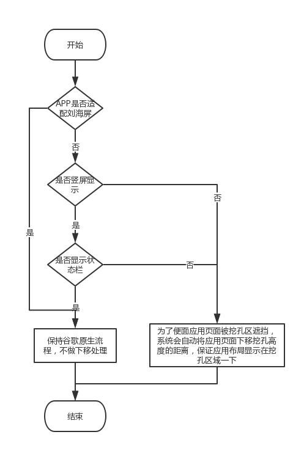

# Android适配刘海屏，

#### 背景

自从iphoneX发布之后，带有刘海的手机的发布应接不暇，各大厂商纷纷效仿，
目前华为，小米，OV等厂商都已经发布了自己的带有刘海的手机。并且Google
大大在今年的IO大会上也已经推出基于Android P 适配方案，但是各大厂商在
P之前就已经发布，我们开发者要针对这些机型最做适配，需要查阅相关厂商的
开发文档，做好我们APP的适配工作。

#### 个人理解

针对手机的刘海区域，是不可操作区域，如果我们的APP（非游戏类APP和可切换
横屏APP）实现了沉浸式状态栏效果，那么一般情况下，刘海区域会在状态栏里，
基于我们的UI设计，一般会把重要的View放在安全区域内，固当是这种情况的时
候，不需要考虑相关适配。如果没有实现沉浸式状态栏，并且是全屏应用，那么
我们就要考虑我们view是否在安全区，这样就要判断手机是否是刘海屏，并且需
要判断相应的刘海区域，然后根据区域的不同，调整我们在刘海区的控件位置。
游戏类APP和可横屏APP的适配同上。

#### 安全区示意图


### 各个厂商适配方案

#### google Android P 适配方案
[Google官网传送门](https://developer.android.com/preview/features#cutout)

Google 从Android P开始提供刘海屏适配方案，通过全新的DisplayCutout类，
可以确定非功能区的位置和形状，这个区域即为刘海区，刘海区不应该显示内容，
通过getDisplayCutout()确定当前手机是否包含刘海区。

我们可以通过修改WindowManager.LayoutParams.layoutInDisplayCutoutMode的
状态来对APP的内容进行布局，Google提供了3种状态可选

>LAYOUT_IN_DISPLAY_CUTOUT_MODE_DEFAULT
>LAYOUT_IN_DISPLAY_CUTOUT_MODE_NEVER
>LAYOUT_IN_DISPLAY_CUTOUT_MODE_SHORT_EDGES

三种状态分别表示DEFAULT只有当刘海区完全包含在状态栏时才是用，NEVER从不使
用刘海区域（这样会显示一条黑边距），SHORT_EDGES表示允许延伸到刘海区。

设置使用刘海区代码:
````
    getSupportActionBar().hide();
    getWindow().getDecorView().setSystemUiVisibility(View.SYSTEM_UI_FLAG_FULLSCREEN
     | View.SYSTEM_UI_FLAG_LAYOUT_FULLSCREEN); 
    //设置页面全屏显示
    WindowManager.LayoutParams lp = getWindow().getAttributes();
    lp.layoutInDisplayCutoutMode = WindowManager
    .LayoutParams.LAYOUT_IN_DISPLAY_CUTOUT_MODE_SHORT_EDGES; 
    //设置页面延伸到刘海区显示
    getWindow().setAttributes(lp);
````

PS:如果应用的布局需要延伸到刘海区显示，那么需要设置View.SYSTEM_UI_FLAG_LAYOUT_FULLSCREEN
同时，如果需要修改状态栏的显示颜色，则需要这是View.SYSTEM_UI_FLAG_LIGHT_STATUS_BAR

获取刘海安全显示区大小和刘海尺寸信息代码：
````
    contentView = getWindow().getDecorView().findViewById(android.R.id.content).getRootView();
    contentView.setOnApplyWindowInsetsListener(new View.OnApplyWindowInsetsListener() {
        @Override
        public WindowInsets onApplyWindowInsets(View view, WindowInsets windowInsets) {
            DisplayCutout cutout = windowInsets.getDisplayCutout();
            if (cutout == null) {
                //通过cutout是否为null判断是否刘海屏手机
                Log.e(TAG, "cutout==null, is not notch screen");
            } else {
                List<Rect> rects = cutout.getBoundingRects();
                if (rects == null || rects.size() == 0) {
                    Log.e(TAG, "rects==null || rects.size()==0, is not notch screen");
                } else {
                    Log.e(TAG, "rect size:" + rects.size());//注意：刘海的数量可以是多个
                    for (Rect rect : rects) {
                        Log.e(TAG, "cutout.getSafeInsetTop():" + cutout.getSafeInsetTop()
                                + ", cutout.getSafeInsetBottom():" + cutout.getSafeInsetBottom()
                                + ", cutout.getSafeInsetLeft():" + cutout.getSafeInsetLeft()
                                + ", cutout.getSafeInsetRight():" + cutout.getSafeInsetRight()
                                + ", cutout.rects:" + rect
                        );
                    }
                }
            }
            return windowInsets;
        }
    });
````

PS：
1. 通过使用windowInsets.getDisplayCutout()是否为null判断是否刘海屏手机，如果为null为非刘海屏；
2. 如果是刘海屏手机，可以通过接口获取相关的刘海信息；
3. 刘海的个数可以有多个。

#### 华为适配方案

[华为官网传送门](https://devcenter-test.huawei.com/consumer/cn/devservice/doc/50114)

华为提供了一套Android O上的刘海适配过程图，从而方便了Android开发人员的
适配工作量，开发人员不必过多的去处理适配工作，华为EMUI会自动适配处理。



从上述华为处理逻辑图可以看出，华为会先判断手机是否为刘海屏手机，然后会继续判断横竖屏显示，
其次判断是否显示状态栏，如果符合条件，那么华为会对app的页面布局进行下移处理。

华为提供了相应的代码方法来判断当前手机是否有刘海屏和刘海屏大小的方法。

代码如下：
````
    /**
     * 华为手机是否有刘海屏
     *
     * @param context context
     * @return 是否有刘海屏
     */
    public static boolean hasNotchInScreen(Context context) {
        boolean ret = false;
        try {
            ClassLoader cl = context.getClassLoader();
            Class HwNotchSizeUtil = cl.loadClass("com.huawei.android.util.HwNotchSizeUtil")
            Method get = HwNotchSizeUtil.getMethod("hasNotchInScreen");
            ret = (boolean) get.invoke(HwNotchSizeUtil);
        } catch (ClassNotFoundException e) {
            Log.e("test", "hasNotchInScreen ClassNotFoundException");
        } catch (NoSuchMethodException e) {
            Log.e("test", "hasNotchInScreen NoSuchMethodException");
        } catch (Exception e) {
            Log.e("test", "hasNotchInScreen Exception");
        } finally {
            return ret;
        }

    /**
     * 获取华为刘海屏的刘海尺寸
     *
     * @param context context
     * @return 刘海尺寸
     */
    public static int[] getNotchSize4Huawei(Context context) {
        int[] ret = new int[]{0, 0};
        try {
            ClassLoader cl = context.getClassLoader();
            Class HwNotchSizeUtil = cl.loadClass("com.huawei.android.util.HwNotchSizeUtil");
            Method get = HwNotchSizeUtil.getMethod("getNotchSize");
            ret = (int[]) get.invoke(HwNotchSizeUtil);
        } catch (ClassNotFoundException e) {
            Log.e(TAG, "getNotchSize ClassNotFoundException");
        } catch (NoSuchMethodException e) {
            Log.e(TAG, "getNotchSize NoSuchMethodException");
        } catch (Exception e) {
            Log.e(TAG, "getNotchSize Exception");
        }
        return ret;
    }
}
````

根据相应代码，我们可以依此判断是否刘海屏和刘海区域大小，进行相关UI调整和适配。

并且，华为提供了2种适配方案：

方案一：

使用新增的Meta-data属性android.notch_support，在应用的AndroidManifest.xml中增加meta-data属性，
此属性不仅可以针对Application生效，也可以对Activity配置生效。

``<meta-data android:name="android.notch_support" android:value="true"/>``

PS：
1. 如果针对Application生效，意味着该应用的所有页面，系统都不会做竖屏场景的特殊下移或者横屏场景
特殊右移
2. 如果针对Activity生效，意味着可以针对单个页面进行刘海屏适配，设置该属性，仅针对当前的Ativity
不做相关处理

方案二：

使用给window添加新增的FLAG_NOTCH_SUPPORT，应用通过增加华为自定义的刘海屏flag，来请求使用或者去除使用
刘海区显示，

代码如下：
````
    /*刘海屏全屏显示FLAG*/
    private static final int FLAG_NOTCH_SUPPORT = 0x00010000;

    /**
     * 设置应用窗口在华为刘海屏手机使用刘海区
     *
     * @param window 应用页面window对象
     */
    public static void setFullScreenWindowLayoutInDisplayCutout(Window window) {
        if (window == null) {
            return;
        }
        WindowManager.LayoutParams layoutParams = window.getAttributes();
        try {
            Class layoutParamsExCls = Class.forName("com.huawei.android.view.LayoutParamsEx");
            Constructor con = layoutParamsExCls.getConstructor(WindowManager.LayoutParams.class);
            Object layoutParamsExObj = con.newInstance(layoutParams);
            Method method = layoutParamsExCls.getMethod("addHwFlags", int.class);
            method.invoke(layoutParamsExObj, FLAG_NOTCH_SUPPORT);
        } catch (Exception e) {
            Log.e(TAG, "other Exception");
        }
    }

    /**
     * 设置应用窗口在华为刘海屏手机使用刘海区
     *
     * @param window 应用页面window对象
     */
    public static void setNotFullScreenWindowLayoutInDisplayCutout(Window window) {
        if (window == null) {
            return;
        }
        WindowManager.LayoutParams layoutParams = window.getAttributes();
        try {
            Class layoutParamsExCls = Class.forName("com.huawei.android.view.LayoutParamsEx");
            Constructor con = layoutParamsExCls.getConstructor(WindowManager.LayoutParams.class);
            Object layoutParamsExObj = con.newInstance(layoutParams);
            Method method = layoutParamsExCls.getMethod("clearHwFlags", int.class);
            method.invoke(layoutParamsExObj, FLAG_NOTCH_SUPPORT);
        } catch (Exception e) {
            Log.e(TAG, "other Exception");
        }
    }
````

PS:对Application生效，意味着该应用的所有页面，系统都不会做竖屏场景的特殊下移或者是
横屏场景的右移特殊处理
PS:在代码里使用，需要在调用后添加
getWindowManager()
.updateViewLayout(getWindow().getDecorView(),getWindow().getDecorView().getLayoutParams());
否则，不会刷新页面生效。

#### 小米适配方案

[小米适配传送门](https://dev.mi.com/console/doc/detail?pId=1293)


