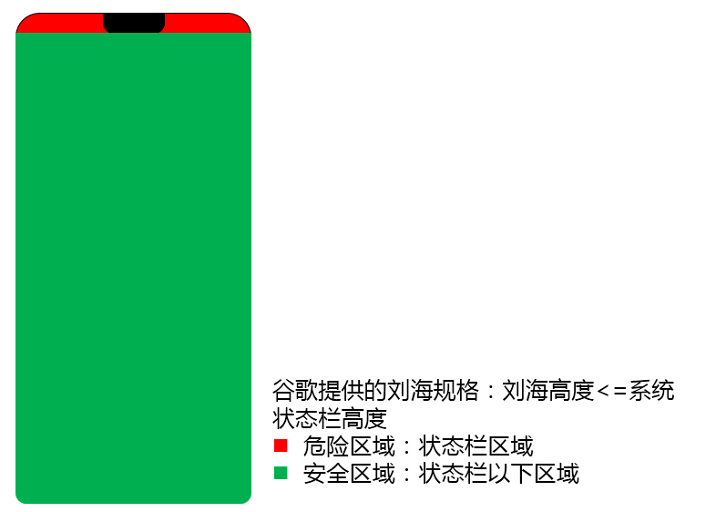

# Android适配刘海屏，

#### 背景

自从iphoneX发布之后，带有刘海的手机的发布应接不暇，各大厂商纷纷效仿，
目前华为，小米，OV等厂商都已经发布了自己的带有刘海的手机。并且Google
大大在今年的IO大会上也已经推出基于Android P 适配方案，但是各大厂商在
P之前就已经发布，我们开发者要针对这些机型最做适配，需要查阅相关厂商的
开发文档，做好我们APP的适配工作。

#### 个人理解

针对手机的刘海区域，是不可操作区域，如果我们的APP（非游戏类APP和可切换
横屏APP）实现了沉浸式状态栏效果，那么一般情况下，刘海区域会在状态栏里，
基于我们的UI设计，一般会把重要的View放在安全区域内，固当是这种情况的时
候，不需要考虑相关适配。如果没有实现沉浸式状态栏，并且是全屏应用，那么
我们就要考虑我们view是否在安全区，这样就要判断手机是否是刘海屏，并且需
要判断相应的刘海区域，然后根据区域的不同，调整我们在刘海区的控件位置。
游戏类APP和可横屏APP的适配同上。

#### 安全区示意图



### 各个厂商适配方案

#### google Android P 适配方案
[Google官网传送门](https://developer.android.com/preview/features#cutout)

Google 从Android P开始提供刘海屏适配方案，通过全新的DisplayCutout类，
可以确定非功能区的位置和形状，这个区域即为刘海区，刘海区不应该显示内容，
通过getDisplayCutout()确定当前手机是否包含刘海区。

我们可以通过修改WindowManager.LayoutParams.layoutInDisplayCutoutMode的
状态来对APP的内容进行布局，Google提供了3种状态可选

> LAYOUT_IN_DISPLAY_CUTOUT_MODE_DEFAULT
> LAYOUT_IN_DISPLAY_CUTOUT_MODE_NEVER
> LAYOUT_IN_DISPLAY_CUTOUT_MODE_SHORT_EDGES

三种状态分别表示DEFAULT只有当刘海区完全包含在状态栏时才是用，NEVER从不使
用刘海区域（这样会显示一条黑边距），SHORT_EDGES表示允许延伸到刘海区。

设置使用刘海区代码:
````
    getSupportActionBar().hide();
    getWindow().getDecorView().setSystemUiVisibility(View.SYSTEM_UI_FLAG_FULLSCREEN
     | View.SYSTEM_UI_FLAG_LAYOUT_FULLSCREEN); 
    //设置页面全屏显示
    WindowManager.LayoutParams lp = getWindow().getAttributes();
    lp.layoutInDisplayCutoutMode = WindowManager.LayoutParams.LAYOUT_IN_DISPLAY_CUTOUT_MODE_SHORT_EDGES; 
    //设置页面延伸到刘海区显示
    getWindow().setAttributes(lp);
````

PS:如果应用的布局需要延伸到刘海区显示，那么需要设置View.SYSTEM_UI_FLAG_LAYOUT_FULLSCREEN
同时，如果需要修改状态栏的显示颜色，则需要这是View.SYSTEM_UI_FLAG_LIGHT_STATUS_BAR

获取刘海安全显示区大小和刘海尺寸信息代码：
````
    contentView = getWindow().getDecorView().findViewById(android.R.id.content).getRootView();
    contentView.setOnApplyWindowInsetsListener(new View.OnApplyWindowInsetsListener() {
        @Override
        public WindowInsets onApplyWindowInsets(View view, WindowInsets windowInsets) {
            DisplayCutout cutout = windowInsets.getDisplayCutout();
            if (cutout == null) {
                Log.e(TAG, "cutout==null, is not notch screen");//通过cutout是否为null判断是否刘海屏手机
            } else {
                List<Rect> rects = cutout.getBoundingRects();
                if (rects == null || rects.size() == 0) {
                    Log.e(TAG, "rects==null || rects.size()==0, is not notch screen");
                } else {
                    Log.e(TAG, "rect size:" + rects.size());//注意：刘海的数量可以是多个
                    for (Rect rect : rects) {
                        Log.e(TAG, "cutout.getSafeInsetTop():" + cutout.getSafeInsetTop()
                                + ", cutout.getSafeInsetBottom():" + cutout.getSafeInsetBottom()
                                + ", cutout.getSafeInsetLeft():" + cutout.getSafeInsetLeft()
                                + ", cutout.getSafeInsetRight():" + cutout.getSafeInsetRight()
                                + ", cutout.rects:" + rect
                        );
                    }
                }
            }
            return windowInsets;
        }
    });
````

PS：
1. 通过使用windowInsets.getDisplayCutout()是否为null判断是否刘海屏手机，如果为null为非刘海屏；
2. 如果是刘海屏手机，可以通过接口获取相关的刘海信息；
3. 刘海的个数可以有多个。

#### 华为适配方案

[华为官网传送门](https://devcenter-test.huawei.com/consumer/cn/devservice/doc/50114)


